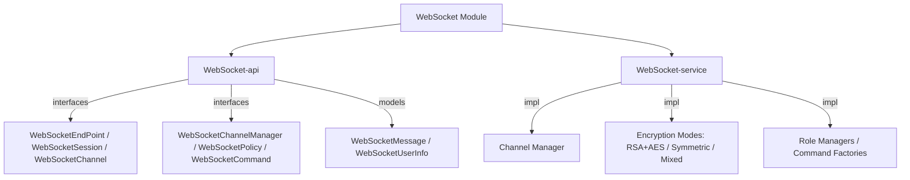
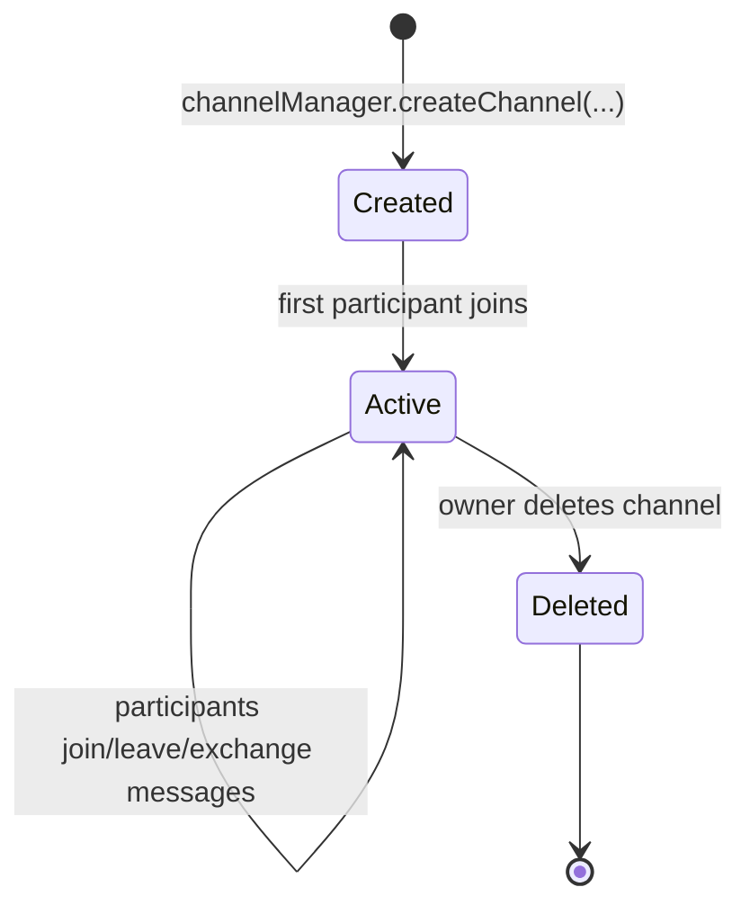

# WebSocket Module

The **WebSocket** module provides a generic WebSocket infrastructure for Water Framework applications. It supports endpoint registration, authentication-aware sessions, multi-user channels with role-based permissions, message policies, and optional end-to-end encryption. No JPA persistence — pure service-based architecture.

## Architecture Overview



## Sub-modules

| Sub-module | Description |
|---|---|
| **WebSocket-api** | All interfaces and model classes — no implementations |
| **WebSocket-service** | Channel manager, encryption modes, role/command factories, session handlers |

## Core Models

### WebSocketMessage

| Field | Type | Description |
|---|---|---|
| `cmd` | String | Command name (used to dispatch handler) |
| `payload` | byte[] | Binary message payload |
| `contentType` | String | Default "text/plain" |
| `timestamp` | Date | Message timestamp |
| `params` | HashMap | Additional key-value parameters |

```java
WebSocketMessage msg = WebSocketMessage.createMessage("chat:send", payload, type);
// or deserialize from JSON string:
WebSocketMessage msg = WebSocketMessage.fromString(rawJsonString);
```

### WebSocketUserInfo

| Field | Type | Description |
|---|---|---|
| `username` | String | Authenticated username |
| `clusterNodeInfo` | ClusterNodeInfo | Node info (null in single-node deployments) |
| `ipAddress` | String | Client IP address |

## Key Interfaces

### WebSocketEndPoint

```java
@FrameworkComponent  // Required — auto-registered with Jetty
public class MyEndPoint implements WebSocketEndPoint {
    public String getPath() { return "/ws/myapp"; }
    public WebSocketSession getHandler(Session session) { return new MySession(session); }
}
```

### WebSocketSession

| Method | Description |
|---|---|
| `isAuthenticationRequired()` | Return true to enforce JWT authentication |
| `authenticate()` | Extract JWT from water-auth-token cookie or Authorization header |
| `authenticateAnonymous()` | Track anonymous connections |
| `initialize()` | Custom setup after connection opens |
| `onMessage(String)` | Dispatch incoming messages by cmd |
| `sendRemote(WebSocketMessage)` | Send a message to this client |
| `dispose()` | Cleanup on connection close |

### WebSocketPolicy

```java
public class RateLimitPolicy implements WebSocketPolicy {
    public boolean isSatisfied(Map<String, Object> params, byte[] payload) {
        return checkRateLimit((String) params.get("username"));
    }
    // Default behavior: close connection on policy failure
}
```

## Channel System

Channels support multi-user communication with roles (owner, participant), moderation (kick, ban, unban), and cluster-aware message delivery.



Channel management via `WebSocketChannelManager`:
- `createChannel(type, name, id, maxParticipants, params, ownerSession, roles)`
- `joinChannel(channelId, participantSession, roles)`
- `leaveChannel(channelId, participantSession)`
- `deliverMessage(message)` / `forwardMessage(channelId, message)`

## Encryption Modes

| Mode | Class | Description |
|---|---|---|
| RSA + AES | `RSAWithAESEncryptionMode` | Client sends RSA public key; server encrypts AES session key |
| Symmetric | `WebSocketSymmetricKeyEncryptionMode` | Pre-shared symmetric key |
| Mixed | `WebSocketMixedEncryptionMode` | Hybrid of RSA and symmetric |

Client public key delivered via header `X-WATER-CLIENT-PUB-KEY` or query param `water-client-pub-key`.

## Permission

Framework-level action: `WebSocketAction.CREATE_CHANNEL` (bitmask = 1).
Channel command permissions controlled by `WebSocketChannelRole.getAllowedCmds()`.

## Constants

```java
WebSocketConstants.WEB_SOCKET_USERNAME_PARAM      = "username"
WebSocketConstants.WEB_SOCKET_RECIPIENT_USER_PARAM = "recipient"
WebSocketConstants.CLIENT_PUB_KEY_HEADER          = "X-WATER-CLIENT-PUB-KEY"
WebSocketConstants.AUTHORIZATION_COOKIE_NAME      = "water-auth-token"
```

## Usage Example

```java
@FrameworkComponent
public class ChatEndPoint implements WebSocketEndPoint {
    @Override public String getPath() { return "/ws/chat"; }

    @Override
    public WebSocketSession getHandler(Session session) {
        return new ChatSession(session);
    }
}

public class ChatSession implements WebSocketSession {
    @Override public boolean isAuthenticationRequired() { return true; }

    @Override
    public void authenticate() {
        // Validate JWT from water-auth-token cookie and set userInfo
    }

    @Override
    public void onMessage(String raw) {
        WebSocketMessage msg = WebSocketMessage.fromString(raw);
        switch (msg.getCmd()) {
            case "chat:send" -> handleSend(msg);
            case "chat:join" -> handleJoin(msg);
            default          -> close("Unknown command");
        }
    }
}
```

## Dependencies

- **Core-api** — `@FrameworkComponent`, `@Inject`, `ComponentRegistry`
- **Core-permission** — `@AccessControl`, `WebSocketAction`
- **Core-security** — `SecurityContext`, `EncryptionUtil`
- `org.eclipse.jetty.websocket:websocket-server` — Jetty WebSocket server API
- `org.eclipse.jetty.websocket:websocket-api` — Session, RemoteEndpoint
